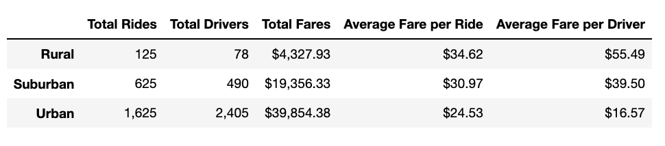
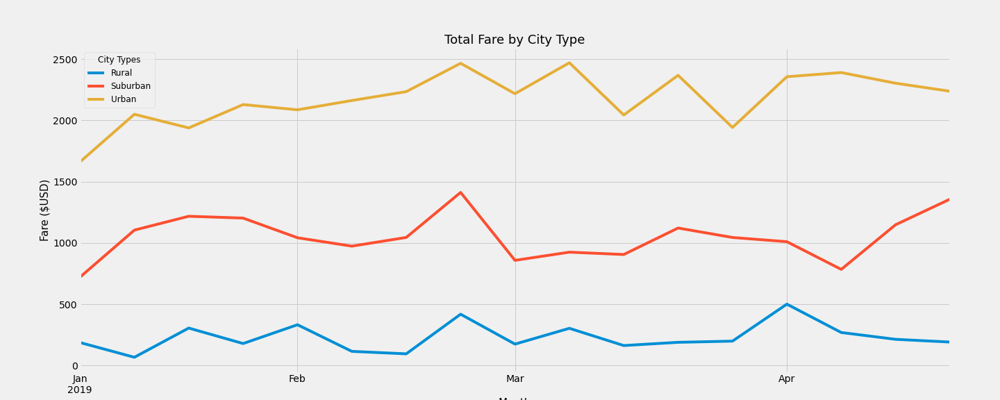

# PyBer_Analysis

# PyBer Analysis
*In depth analysis for PyBer, a Ride-Share company*

## Project Overview and Background
### Purpose
The purpose of the following anlysis is to conduct an in depth investigation for the Ride-Share company *PyBer* as well as display our understanding of the data using visualization thechniques within the python graphing library A.K.A *Matplotlib*. Illustrating the relationship between the type of the city -- urban, suburban and rural -- and their correlation between rides, drivers and fares, the data sources:
  - [city_data.csv](Resources/city_data.csv)
  - [ride_data.csv](Resources/ride_data.csv)
  
uses accumulateed data from January to early May of 2019 on the following metrics: 
-	The total number of rides for each city type. 
-	The total number of drivers for each city type.
-	The sum of the fares for each city type.
-	The average fare per ride for each city type.
-	The average fare per driver for each city type.
-	The total fares for each week by city type. 

With a focus on exploratorty data analysis techniques (EDA) we are able to sort, clean, and create smaller data sets that are not only far easier to work with when coming to conclusions, but is also far easier for the end user to understand along with our supporting charts/graphs

## Results 
 
Using the table below *(A dataframe that summarizes the data per city type)* we are able to conclude results for each city type 
1. urban 
2. suburban 
3. rural 

as they correlate to the amount of rides, drivers and fares using urban cities as our baseline reading.

     

<ins> **1.	The total number of rides for each city type.** </ins>
  -	The total amount of rides is approx. 2.6-times higher in urban cities when compared to suburban cities.
  -	The total amount of rides is approx. 13-times higher in urban cities when compared to rural cities.

<ins>**2.	The total number of drivers for each city type.**</ins>
  -	The total amount of drivers is almost approx. 5-times :arrow_up: in urban cities when compared to suburban cities.
  -	The total amount of drivers is almost approx. 31-times :arrow_up: in urban cities when compared to rural cities.

<ins>**3.	The sum of the fares for each city type.**</ins>
  -	The total amount of fares is approx. 2-times :arrow_up: in urban cities when compared to suburban cities. 
  -	The total amount of fares is approx. 9-times :arrow_up: in urban cities when compared to rural cities.

<ins>**4.	The average fare per ride for each city type.**</ins>
  -	The average fare per ride is approx. 1.3-times :arrow_down: in urban cities when compared to suburban.
  -	The average fare per ride is approx. 1.4-times :arrow_down: in urban cities when compared to rural cities.

<ins>**5.	The average fare per driver for each city type.**</ins>
  -	The average fare per driver is approx. 2.4-times :arrow_down: in urban cities when compared to suburban cities.
  -	The average fare per driver is spprox. 3.3-times :arrow_down: in urban cities when compared to rural cities.

<ins>**6.	The total fares for each week by city type.**</ins>

  From the multi-line graph *Total Fare by City Type* we can see the results for each city type – urban, suburban and rural as it relates to the total fare amount per week.

     

  -	Urban cities have the highest total fares overall. The amount is ranging from the lowest at about $1,600 per week to the highest at about $2,500 per week. 
  -	Rural cities have the lowest total fares overall. The amount is ranging from the lowest at about $250 per week to the highest at about $500 per week.
  -	Suburban cities fall in between. The total fares amount is ranging from the lowest at about $650 per week to the highest at about $1,450 per week.
  -	All cities have pretty steady flow of total fares from week to week with a matching spike in the third week in February.
